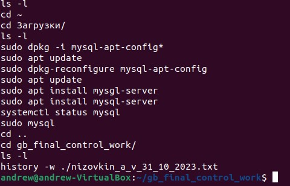
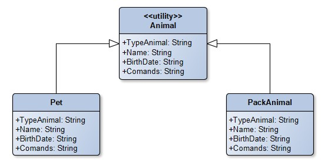
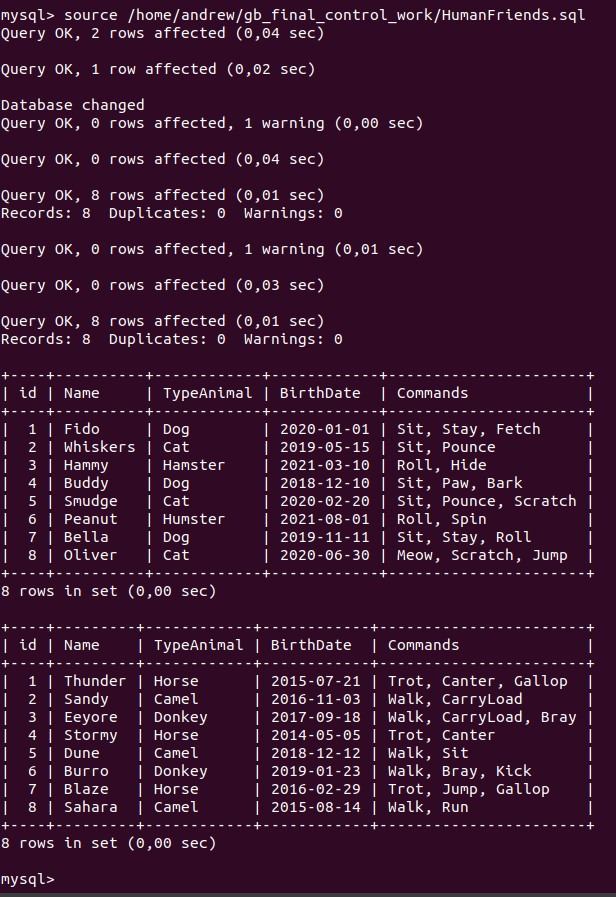
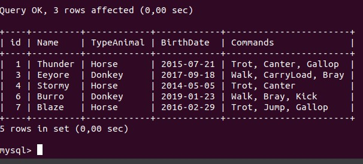
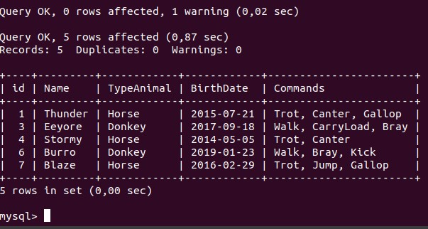
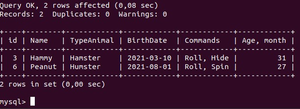
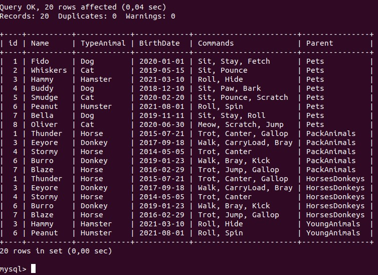
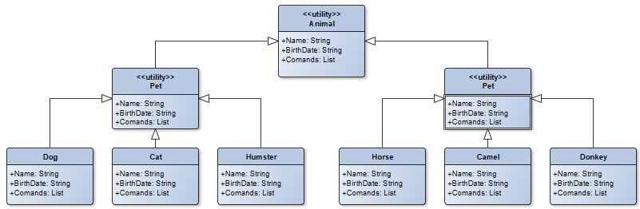

# Итоговая контрольная работа

### Информация о проекте

> Необходимо организовать систему учета для питомника в котором живут домашние и Packanimals. 

## Операционные системы и виртуализация (Linux)

> ### 1. Использование команды `cat` в Linux
> - Создать два текстовых файла: "Pets"(Домашние животные) и "Packanimals"(вьючные) в терминале Linux. В первом файле перечислить собак, кошек и хомяков. Во втором — лошадей, верблюдов и ослов.
> - Объединить содержимое этих двух файлов в один и просмотреть его содержимое.
> - Переименовать получившийся файл в "HumanFriends".

_Создаём файлы:_

```
cat > Pets.txt
dog, cat, hamster
Ctr + d
cat Pets.txt
```


```
cat > Packanimals.txt
horse, camel, donkey
Ctr + d
cat Packanimals.txt
```


_Объединяем содержимое файлов в один и смотрим содержимое:_

```
cat Pets.txt Packanimals.txt > NewFile.txt
cat NewFile.txt
```


_Переименовываем полученный файл и смотрим содержимое папки:_

```
mv NewFile.txt HumanFriends.txt
ls -l
```


---

> ### 2. Работа с директориями в Linux
> - Создать новую директорию и переместить туда файл "HumanFriends".

```
mkdir NewDir
mv HumanFriends.txt ./NewDir/HumanFriends.txt
```


---

> ### 3. Работа с MySQL в Linux. 
> “Установить MySQL на вашу вычислительную машину ”
> - Подключить дополнительный репозиторийMySQL и установить один из пакетов из этого репозитория.

_На официальном сайте [mysql](https://dev.mysql.com/) находим подходящий пакет `mysql-apt-config_0.8.28-1_all.deb` и скачиваем его.

_Переходим в папку загрузки и выполняем:_

```
sudo dpkg -i mysql-apt-config*
```  

_Обновляем информацию о пакетах:_

```
sudo apt update
```

_Устанавливаем mysql-server:_

```
sudo apt install -y mysql-server
```

_Проверяем:_

```
systemctl status mysql
```


---

> ### 4. Управление deb-пакетами
> - Установить и затем удалить deb-пакет, используя команду `dpkg`.

_На [Официальном сайте virtualBox](https://www.virtualbox.org/) скачиваем подходящий по параметрам пакет и после этого в терминале выполняем:_

```
sudo dpkg -i virtualbox-7.0_7.0.12-159484~Ubuntu~jammy_amd64.deb 

```


_Лечим ошибки:_

```
sudo apt -f install
```


_Удаляем пакет:_

```bash
sudo dpkg -r virtualbox-7.0
sudo apt autoremove
```


> ### 5. История команд в терминале Ubuntu
> - Сохранить и выложить историю ваших терминальных команд в Ubuntu. В формате: Файла с ФИО, датой сдачи, номером группы(или потока)

```bash
history -w ./nizovkin_a_v_31_10_2023.txt
cat ./nizovkin_a_v_31_10_2023.txt
```



## Объектно-ориентированное программирование

> ### 6. Диаграмма классов 
> - Создать диаграмму классов с родительским классом "Животные", и двумя подклассами: "Pets" и "Packanimals". В составы классов которых в случае Petsвойдут классы: собаки, кошки, хомяки, а в класс Packanimals войдут: Лошади, верблюды и ослы.
> Каждый тип животных будет характеризоваться (например, имена, даты рождения, выполняемые команды и т.д)



> ### 7. Работа с MySQL
> 7.1. После создания диаграммы классов в 6 пункте, в 7 пункте база данных "HumanFriends" должна быть структурирована в соответствии с этой диаграммой. Например, можно создать таблицы, которые будут соответствовать классам "Pets" и "Packanimals", и в этих таблицах будут поля, которые характеризуют каждый тип животных (например, имена, даты рождения, выполняемые команды и т.д.). 
> 7.2   - В ранее подключенном MySQL создать базу данных с названием "HumanFriends".
> - Заполнить таблицы данными о животных, их командах и датами рождения.

_Далее в тексте показаны фрагменты файла HumanFriend.sql_

```sql
DROP DATABASE IF EXISTS HumanFriends;
CREATE DATABASE HumanFriends;
USE  HumanFriends;

DROP TABLE IF EXISTS Pets;
CREATE TABLE Pets (
    id INT PRIMARY KEY,
    Name VARCHAR(32),
    TypeAnimal VARCHAR(32),
    BirthDate DATE,
    Commands VARCHAR(50)
);

INSERT INTO Pets VALUES
(1, 'Fido', 'Dog', '2020-01-01', 'Sit, Stay, Fetch'),
(2, 'Whiskers', 'Cat', '2019-05-15', 'Sit, Pounce'),
(3, 'Hammy', 'Hamster', '2021-03-10', 'Roll, Hide'),
(4, 'Buddy', 'Dog', '2018-12-10', 'Sit, Paw, Bark'),
(5, 'Smudge', 'Cat', '2020-02-20', 'Sit, Pounce, Scratch'),
(6, 'Peanut', 'Humster', '2021-08-01', 'Roll, Spin'),
(7, 'Bella', 'Dog', '2019-11-11', 'Sit, Stay, Roll'),
(8, 'Oliver', 'Cat', '2020-06-30', 'Meow, Scratch, Jump');

DROP TABLE IF EXISTS PackAnimals;
CREATE TABLE PackAnimals (
    id INT PRIMARY KEY,
    Name VARCHAR(32),
    TypeAnimal VARCHAR(32),
    BirthDate DATE,
    Commands VARCHAR(50)
);

INSERT INTO PackAnimals VALUES
(1, 'Thunder', 'Horse', '2015-07-21', 'Trot, Canter, Gallop'),
(2, 'Sandy', 'Camel', '2016-11-03', 'Walk, CarryLoad'),
(3, 'Eeyore', 'Donkey', '2017-09-18', 'Walk, CarryLoad, Bray'),
(4, 'Stormy', 'Horse', '2014-05-05', 'Trot, Canter'),
(5, 'Dune', 'Camel', '2018-12-12', 'Walk, Sit'),
(6, 'Burro', 'Donkey', '2019-01-23', 'Walk, Bray, Kick'),
(7, 'Blaze', 'Horse', '2016-02-29', 'Trot, Jump, Gallop'),
(8, 'Sahara', 'Camel', '2015-08-14', 'Walk, Run');

SELECT * FROM Pets;
SELECT * FROM  PackAnimals;
```




> - Удалить записи о верблюдах и объединить таблицы лошадей и ослов. 

_Удаляем записи о верблюдах из таблицы PackAnimals:_

```sql
DELETE FROM PackAnimals
WHERE TypeAnimal = 'Camel';

SELECT * FROM  PackAnimals;
```



_Создаём таблицу, объединяющую лошадей и ослов:_

```sql
DROP TABLE IF EXISTS HorsesDonkeys;
CREATE TABLE HorsesDonkeys
SELECT * FROM PackAnimals
WHERE TypeAnimal = 'Horse' OR TypeAnimal = 'Donkey';

SELECT * FROM HorsesDonkeys;
```



> - Создать новую таблицу для животных в возрасте от 1 до 3 лет и вычислить их возраст с точностью до месяца. 

_Создаём таблицу YoungAnimals:_

```sql
DROP TABLE IF EXISTS YoungAnimals;
CREATE TABLE YoungAnimals
SELECT Pets.id, Pets.Name, Pets.TypeAnimal, Pets.BirthDate, Pets.Commands,
TIMESTAMPDIFF(MONTH, Pets.BirthDate, CURDATE()) AS 'Age, month'
FROM Pets
WHERE ((CAST( NOW() as DATE ) - Pets.BirthDate) / 10000) BETWEEN 1 AND 3

UNION

SELECT PackAnimals.id, 
PackAnimals.Name, PackAnimals.TypeAnimal, PackAnimals.BirthDate, PackAnimals.Commands,
TIMESTAMPDIFF(MONTH, PackAnimals.BirthDate, CURDATE()) AS 'Age, month'
FROM PackAnimals
WHERE ((CAST( NOW() as DATE ) - PackAnimals.BirthDate) / 10000) BETWEEN 1 AND 3;

SELECT * FROM YoungAnimals;
```



> - Объединить все созданные таблицы в одну, сохраняя информацию о принадлежности к исходным таблицам.

_Создаём таблицу SummaryTable:_

```sql
DROP TABLE IF EXISTS SummaryTable;
CREATE TABLE  SummaryTable
SELECT p.id, p.Name, p.TypeAnimal, p.BirthDate, p.Commands,
'Pets' AS Parent
FROM Pets AS p

UNION

SELECT pa.id, pa.Name, pa.TypeAnimal, pa.BirthDate, pa.Commands,
'PackAnimals' AS Parent
FROM PackAnimals AS pa

UNION

SELECT hd.id, hd.Name, hd.TypeAnimal, hd.BirthDate, hd.Commands,
'HorsesDonkeys' AS Parent
FROM HorsesDonkeys AS hd

UNION

SELECT y.id, y.Name, y.TypeAnimal, y.BirthDate, y.Commands,
'YoungAnimals' AS Parent
FROM YoungAnimals AS y;

SELECT * FROM SummaryTable;

```



> ### 8. ООП и Java
> - Создать иерархию классов в Java, который будет повторять диаграмму классов созданную в задаче 6(Диаграмма классов) .



> ### 9. Программа-реестр домашних животных
> - Написать программу на Java, которая будет имитировать реестр домашних животных. Должен быть реализован следующий функционал:    
>
> 9.1. Добавление нового животного
> - Реализовать функциональность для добавления новых животных в реестр. Животное должно определяться в правильный класс (например, "собака", "кошка", "хомяк" и т.д.)
>
> 9.2. Список команд животного
> - Вывести список команд, которые может выполнять добавленное животное (например, "сидеть", "лежать").
>
> 9.3. Обучение новым командам
> - Добавить возможность обучать животных новым командам.
>
> 9.4 Вывести список животных по дате рождения
>
> 9.5. Навигация по меню
> - Реализовать консольный пользовательский интерфейс с меню для навигации между вышеуказанными функциями.
>
> 9.6. Счетчик животных
> - Создать механизм, который позволяет вывести на экран общее количество созданных животных любого типа (Как домашних, так и вьючных), то есть при создании каждого нового животного счетчик увеличивается на “1”. 

