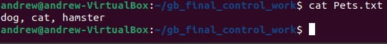

# Итоговая контрольная работа

### Информация о проекте

> Необходимо организовать систему учета для питомника в котором живут домашние и Packanimals. 

## Операционные системы и виртуализация (Linux)

> 1. Использование команды `cat` в Linux
> - Создать два текстовых файла: "Pets"(Домашние животные) и "Packanimals"(вьючные) в терминале Linux. В первом файле перечислить собак, кошек и хомяков. Во втором — лошадей, верблюдов и ослов.
> - Объединить содержимое этих двух файлов в один и просмотреть его содержимое.
> - Переименовать получившийся файл в "HumanFriends".

_Создаём файлы:_

```
cat > Pets.txt
dog, cat, hamster
Ctr + d
cat Pets.txt
```


```
cat > Packanimals.txt
horse, camel, donkey
Ctr + d
cat Packanimals.txt
```


_Объединяем содержимое файлов в один и смотрим содержимое:_

```
cat Pets.txt Packanimals.txt > NewFile.txt
cat NewFile.txt
```


_Переименовываем полученный файл и смотрим содержимое папки:_

```
mv NewFile.txt HumanFriends.txt
ls -l
```


> 2. Работа с директориями в Linux
> - Создать новую директорию и переместить туда файл "HumanFriends".

```
mkdir NewDir
mv HumanFriends.txt ./NewDir/HumanFriends.txt
```


> 3. Работа с MySQL в Linux. “Установить MySQL на вашу вычислительную машину ”
> - Подключить дополнительный репозиторийMySQL и установить один из пакетов из этого репозитория.

_На официальном сайте [mysql](https://dev.mysql.com/) находим подходящий пакет `mysql-apt-config_0.8.28-1_all.deb` и скачиваем его с помощью утилиты `wget`:_

```
wget https://dev.mysql.com/downloads/repo/apt/mysql-apt-config_0.8.28-1_all.deb
```
_Переходим в папку загрузки и выполняем:_

```
sudo dpkg -i mysql-apt-config_0.8.28-1_all.deb
```  


_Обновляем информацию о пакетах:_

```
sudo apt update
```

_Устанавливаем mysql-server:_

```
sudo apt install -y mysql-server
```

_Проверяем:_

```
systemctl status mysql
```


> 4. Управление deb-пакетами
> - Установить и затем удалить deb-пакет, используя команду `dpkg`.

_На [Официальном сайте virtualBox](https://www.virtualbox.org/) скачиваем подходящий по параметрам пакет и после этого в терминале выполняем:_

```
sudo dpkg -i virtualbox-7.0_7.0.12-159484~Ubuntu~jammy_amd64.deb 

```


_Лечим ошибки:_

```
sudo apt -f install
```


_Удаляем пакет:_

```
sudo dpkg -r virtualbox-7.0
```

